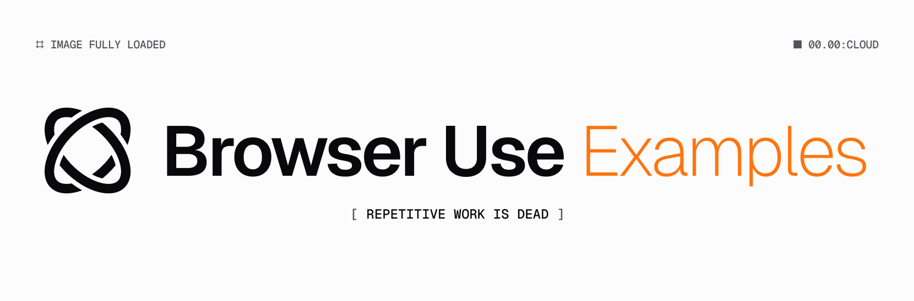

# 🤖 Browser Use Examples

> A collection of Browser Use SDK examples.

### TypeScript

- **[scrapper](./scrapper/README.md)**: A utility for extracting complex, scattered data about entities, saving results to a database, and providing live previews of scraping progress.
- **[agent](./agent/README.md)**: Demonstrates how to create an agent that can browse the web and execute browser tasks using Browser Use, including integration with Vercel AI SDK and chat interfaces.
- **[discord](./discord/README.md)**: An example Discord bot that uses the Browser Use Cloud API to execute browser tasks and interact with users via Discord commands.

### Python

- **[slack](./slack/README.md)**: An example Slack bot that listens for mentions and interacts with users using the Browser Use SDK, including setup for local development and required Slack permissions.
