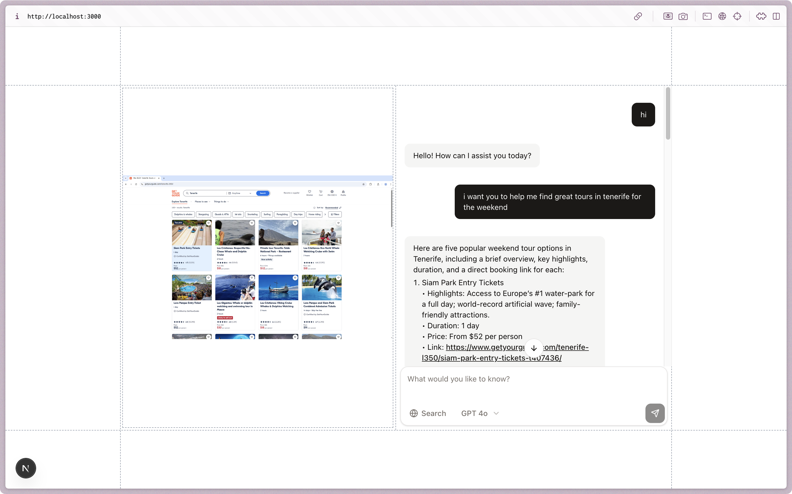

## Browser Use Agent

> Create an agent that can Browse the Web using Browser Use.

A Next.js application that provides an AI-powered web browsing assistant using the Browser Use SDK. This agent can execute tasks in a web browser, monitor their progress, and provide real-time updates through a streaming interface.

## Features

- **Web Task Execution**: Run automated tasks in web browsers
- **Real-time Monitoring**: Stream task progress and status updates
- **Session Management**: Continue tasks across browser sessions
- **AI Integration**: Powered by AI models for intelligent task handling
- **Streaming Responses**: Real-time updates using Vercel AI SDK

## Core Components

### API Route (`/api/chat`)
The main API endpoint that handles chat interactions and web task execution:

- **`runTask`**: Creates and executes new browser tasks
- **`continueTask`**: Continues existing tasks using session IDs
- **Task Status Tracking**: Monitors running, paused, stopped, and finished states
- **Live URL Access**: Provides real-time browser session URLs

## Setup

### Prerequisites
- Node.js 18+ 
- pnpm package manager

### Environment Variables
Create a `.env.local` file with the following variables:

```bash
# Browser Use API Key (required)
BROWSER_USE_API_KEY=your_browser_use_api_key_here
```

### Installation & Development

```bash
# Install dependencies
pnpm i

# Start Dev Server
pnpm dev
```

Open [http://localhost:3000](http://localhost:3000) to view the application.

## Usage

1. **Start a Task**: Use the chat interface to describe what you want to accomplish in the browser
2. **Monitor Progress**: Watch real-time updates as the task executes
3. **Access Live Session**: Click on the live URL to see the browser in action
4. **Continue Tasks**: Use session IDs to resume interrupted tasks

## Architecture

The application uses:
- **Next.js 14** with App Router
- **Vercel AI SDK** for streaming responses
- **Browser Use SDK** for web automation
- **TypeScript** for type safety
- **Tailwind CSS** for styling

<p align="center">
  
</p>
