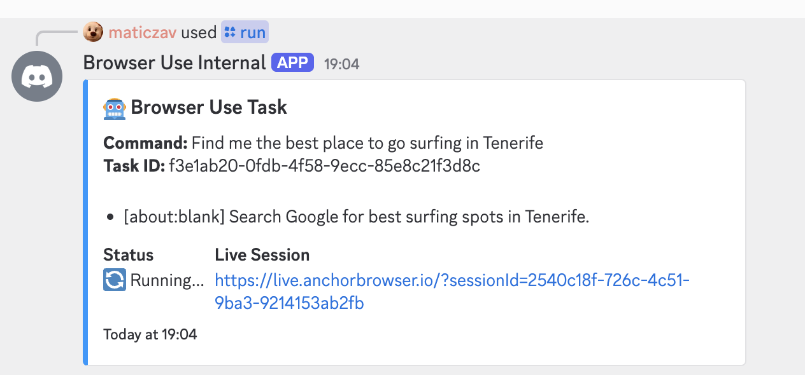
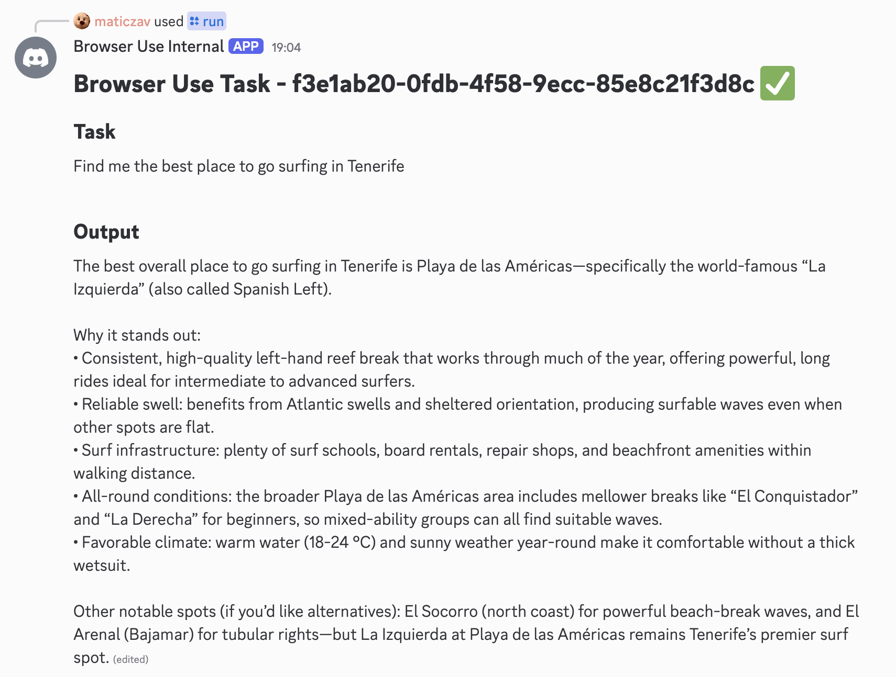

# Browser Use Discord

> An example Discord Bot using Browser Use Cloud API to execute browser tasks.

<p align="center">
  
</p>

<p align="center">
  
</p>

## TLDR

### Creating a `/` Command

> [`src/commands/run.ts`](./src/commands/run.ts)

```ts
const res = await browseruse.tasks.create({
  task: command,
  agentSettings: { llm: "o3" },
});

const gen = browseruse.tasks.stream(res.id);

for await (const event of gen) {
  const status = event.data;

  switch (status.status) {
    case "started":
    case "stopped":
    case "paused": {
      const liveUrl = status.session.liveUrl ?? "⏳ Waiting...";

      const description: string[] = [];

      description.push(`**Command:** ${command}`);
      description.push(`**Task ID:** ${status.id}`);

      description.push("");

      if (status.steps) {
        for (const step of status.steps) {
          description.push(`- [${step.url}] ${step.nextGoal}`);
        }
      } else {
        description.push("No steps yet");
      }

      if (status.doneOutput) {
        description.push("");
        description.push(status.doneOutput);
      }

      const embed = new EmbedBuilder()
        .setTitle("🤖 Browser Use Task")
        .setDescription(description.join("\n"))
        .setColor(0x0099ff)
        .addFields(
          { name: "Status", value: "🔄 Running...", inline: true },
          { name: "Live Session", value: liveUrl, inline: true },
        )
        .setTimestamp();

      await interaction.editReply({ embeds: [embed] });

      break;
    }

    case "finished": {
      const output: string[] = [];

      output.push(`# Browser Use Task - ${status.id} ✅`);
      output.push(`## Task`);
      output.push(command);

      output.push("");

      output.push(`## Output`);
      output.push(status.doneOutput ?? "No output");

      await interaction.editReply({ content: output.join("\n"), embeds: [] });

      break;
    }
    default:
      throw new ExhaustiveSwitchCheck(status.status);
  }

  console.log(`[${status.id}] ${status.status}`);
}
```

## Development Setup

```bash
# Install dependencies
pnpm i

# Start Dev
pnpm dev
```

### Getting Environment Variables

> Set up environment variables to successfully run this example locally.

- Browser Use Cloud API - [Get API Key](https://cloud.browser-use.com/billing)

Copy `.env.example` into `.env` and run the project!

### Useful Links

- https://discord.com/developers/docs/quick-start/getting-started#step-0-project-setup
- https://discord.js.org/
