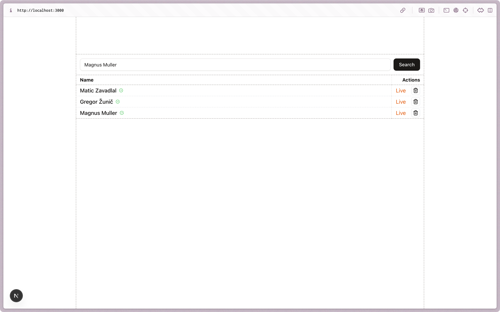
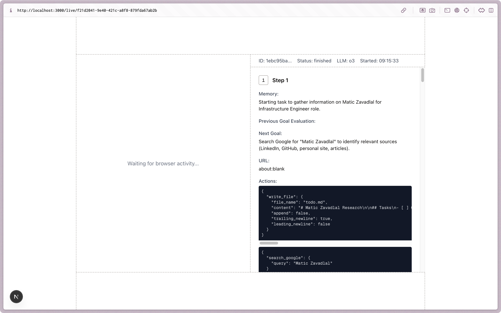

# Browser Use Scrapper

> A general utility for finding complex scattered data about
> something.

<p align="center">
  
</p>

<p align="center">
  
</p>

## TLDR

### Saving Result to Database

> [`src/app/api/webhook/route.ts`](./src/app/api/webhook/route.ts)

```ts
export async function POST(request: Request) {
  const body = await request.text();

  const signature = request.headers.get("x-browser-use-signature") as string;
  const timestamp = request.headers.get("x-browser-use-timestamp") as string;

  const event = await verifyWebhookEventSignature(
    {
      body,
      signature,
      timestamp,
    },
    {
      secret: process.env.SECRET_KEY!,
    }
  );

  if (event.ok) {
    switch (event.event.type) {
      case "test":
        break;
      case "agent.task.status_update":
        break;

      default:
        throw new ExhaustiveSwitchCheck(event.event);
    }
  }

  return new Response("OK");
}
```

### Integrating Live Preview

> [`src/app/api/scrape/[id]/route.ts`](./src/app/api/scrape/[id]/route.ts)

```tsx
export async function GET(
  request: Request,
  { params }: { params: Promise<{ id: string }> }
) {
  const { id } = await params;

  if (typeof id !== "string") {
    return new Response("Bad request", { status: 400 });
  }

  const entry = await db.query.profiles.findFirst({
    where: eq(schema.profiles.id, id),
  });

  if (entry == null) {
    return new Response("Not found", { status: 404 });
  }

  // Create Task
  const gen = browseruse.tasks.stream({
    taskId: entry.browserUseTaskId,
    schema: zScrapperSchema,
  });

  const stream = gtos(gen, {});

  return new Response(stream, {
    headers: {
      "Content-Type": "text/event-stream; charset=utf-8",
      "Cache-Control": "no-cache, no-transform",
      Connection: "keep-alive",
      "X-Accel-Buffering": "no", // avoid proxy buffering
    },
  });
}
```

## Developer Guide

```sh
# Generate Schema Migrations
pnpm drizzle-kit generate

# Set Up Development Database
docker compose up -d

# Migrate Schema
pnpm drizzle-kit migrate

# Start Development Server
pnpm dev

# Start Browser Use CLI
pnpm webhook
```
